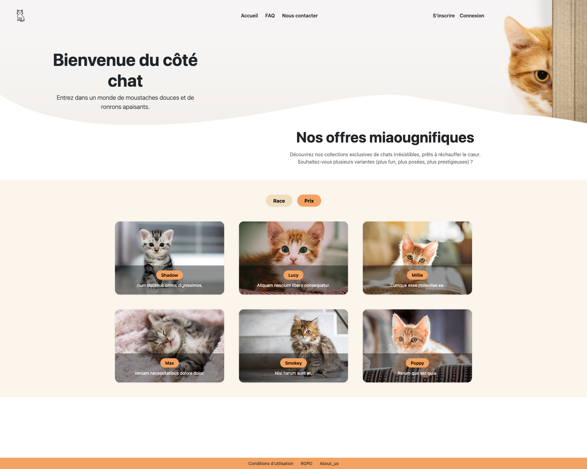
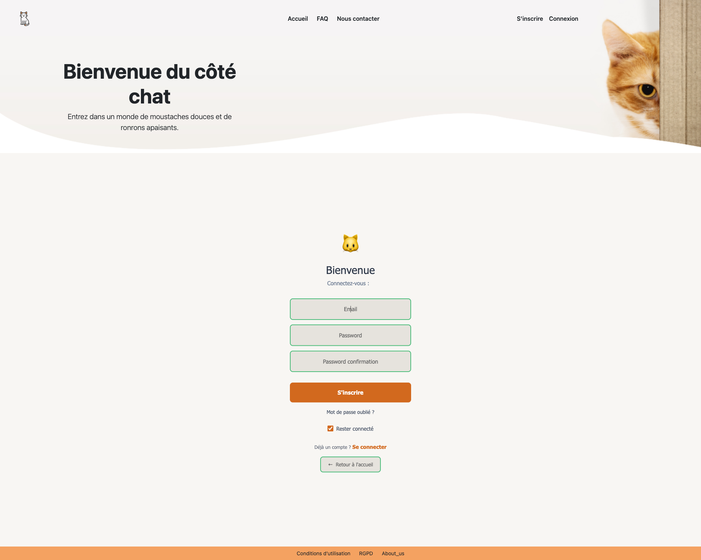
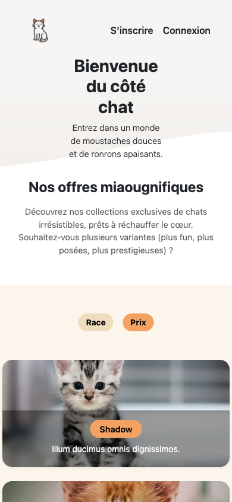
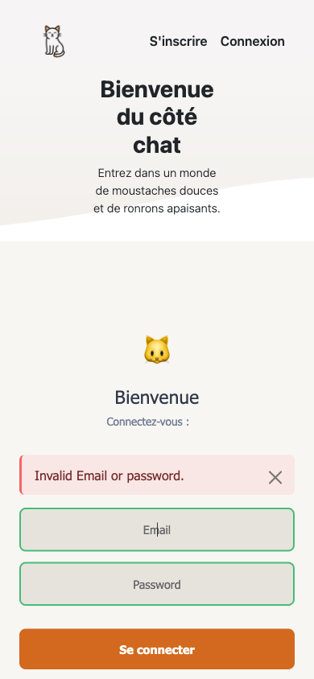

# 🐱 Kitten Lovers - E-commerce Platform

> An e-commerce platform for selling high-quality kitten photographs built with Ruby on Rails 8.0.2.1

**Live Site**: https://kitten-lovers-d41eb669d13c.herokuapp.com/

## 📋 Quick Start

| Section                              | Description                                  |
| ------------------------------------ | -------------------------------------------- |
| [🛠️ Tech Stack](#️-technical-stack)  | Ruby on Rails, PostgreSQL, Stripe, Avo Admin |
| [🚀 Installation](#-getting-started) | Setup instructions and environment variables |
| [📊 Database](#database-design)      | Schema and relationships                     |
| [📸 Screenshots](#-screenshots)      | Application preview (desktop & mobile)       |

---

## 📋 Project Overview

**Kitten Lovers** is an e-commerce platform dedicated to selling high-quality kitten photographs. Built with Ruby on Rails 8.0.2.1 and Ruby 3.4.5, this project provides a modern, user-friendly online marketplace for feline photography enthusiasts with integrated cart management, Stripe payments, and admin interface.

---

## 👥 Development Team

- **Théo BANNERY** - Full Stack Developer
- **Florian BENOIT** - Full Stack Developer
- **Matthieu MARILLER** - Full Stack Developer

---

## 🛠️ Technical Stack

### Backend

- **Framework**: Ruby on Rails 8.0.2.1
- **Ruby Version**: 3.4.5
- **Database**: PostgreSQL with Solid Cache/Queue/Cable
- **Authentication**: Devise with custom UserMailer
- **Payment**: Stripe integration (implemented)
- **Admin Interface**: Avo 3.x (modern Rails admin)
- **Pagination**: Kaminari
- **Background Jobs**: Solid Queue

### Frontend

- **JavaScript**: Stimulus framework with Turbo
- **Module System**: Importmap Rails
- **Styling**: CSS with mobile-first approach
- **Asset Pipeline**: Propshaft (Rails 8 default)
- **Responsive**: Mobile and desktop optimized

### Deployment

- **Platform**: Heroku
- **Server**: Puma with Thruster
- **Pipeline**: Automated deployment from main branch

---

## 🏗️ Architecture

### MVC Pattern

- **Models**: Item, User, Order, OrderItem, Cart, CartItem
- **Controllers**: Custom Rails controllers with admin namespace
- **Views**: ERB templates with Stimulus controllers
- **Admin**: Avo 3.x resources (OrderResource, CartResource)

### Database Design

```
                ┌─────────────────────────────────────────────────────────┐
                │           KITTEN LOVERS DATABASE SCHEMA                │
                └─────────────────────────────────────────────────────────┘

                            [USERS] (Central Entity)
                                      │
                         ┌────────────┼────────────┐
                         │            │            │
                         ▼            ▼            ▼
                     [CARTS]      [ORDERS]   [PURCHASED_ITEMS]
                         │            │            │
                         │ 1:N        │ 1:N        │ N:1
                         ▼            ▼            ▼
                   [CART_ITEMS]  [ORDER_ITEMS]     │
                         │            │            │
                         │ N:1        │ N:1        │
                         ▼            ▼            │
                         └─── [ITEMS] ◄────────────┘

                ┌─────────────────────────────────────────────────────────┐
                │ Core Tables:                                            │
                │ • users (customers with Devise authentication)         │
                │ • items (kitten photos with pricing)                   │
                │ • carts (session-based shopping carts)                 │
                │ • orders (purchase transactions with Stripe)           │
                │ • cart_items (items in shopping carts)                 │
                │ • order_items (individual items in orders)             │
                │ • purchased_items (purchase history audit trail)       │
                │                                                         │
                │ Business Flows:                                         │
                │ 🛒 Shopping: USERS → CARTS → CART_ITEMS → ITEMS       │
                │ 💳 Purchase: USERS → ORDERS → ORDER_ITEMS → ITEMS     │
                │ 📚 History: USERS → PURCHASED_ITEMS → ITEMS           │
                └─────────────────────────────────────────────────────────┘
```

### Key Features

- **Photo Catalog**: Browse high-resolution kitten photos with pagination
- **Shopping Cart**: Session-based cart with real-time updates via Stimulus
- **User Authentication**: Devise-powered registration/login with custom mailers
- **Order Management**: Complete Stripe checkout workflow with confirmations
- **Admin Panel**: Avo 3.x interface for managing items, orders, users, and carts
- **Responsive Design**: Mobile-first design with desktop optimization
- **Email System**: Custom UserMailer for account and order confirmations

---

## 🚀 Getting Started

### Prerequisites

- Ruby 3.4.5
- Rails 8.0.2.1
- PostgreSQL
- Node.js (for Importmap/Stimulus)

### Installation

```bash
# Clone the repository
git clone https://github.com/your-username/kitten_lovers.git
cd kitten_lovers

# Install dependencies
bundle install

# Environment setup
cp .env.example .env
# Edit .env with your actual configuration values

# Database setup
rails db:create
rails db:migrate
rails db:seed

# Start the server with all services
bin/dev
```

### Environment Variables

See `.env.example` for all required variables:

```env
# Gmail SMTP configuration
GMAIL_USERNAME=your_gmail_email@gmail.com
GMAIL_PASSWORD=your_gmail_app_specific_password

# Stripe payment keys
STRIPE_PUBLISHABLE_KEY=pk_test_your_stripe_key
STRIPE_SECRET_KEY=sk_test_your_stripe_key

# Rails security
SECRET_KEY_BASE=your_generated_secret_key
```

---

## 📸 Screenshots

### Desktop Views (1920x1080)

<table align="center">
  <tr>
    <td align="center" width="33%">
      <br>
      <b>🏠 Homepage</b><br>
      <i>Browse featured kitten photos</i>
    </td>
    <td align="center" width="33%">
      <br>
      <b>📸 Photo Catalog</b><br>
      <i>Complete photo collection with pagination</i>
    </td>
    <td align="center" width="33%">
      <br>
      <b>🛒 Shopping Cart</b><br>
      <i>Review selected items before checkout</i>
    </td>
  </tr>
</table>

<table>
  <tr>
    <td align="center" width="33%">
      <br>
      <b>🔐 Login Page</b><br>
      <i>Secure user login with Devise</i>
    </td>
    <td align="center" width="33%">
      <br>
      <b>📝 Registration</b><br>
      <i>New user registration</i>
    </td>
    <td align="center" width="33%">
      <br>
      <b>⚙️ Admin Dashboard</b><br>
      <i>Avo admin interface</i>
    </td>
  </tr>
</table>

### Mobile Views (390x844)

<table align="center">
  <tr>
    <td align="center" width="50%">
      <br>
      <b>📱 Photo Catalog Mobile</b><br>
      <i>Touch-friendly browsing</i>
    </td>
    <td align="center" width="50%">
      <br>
      <b>📱 Shopping Cart Mobile</b><br>
      <i>Mobile-optimized checkout</i>
    </td>
  </tr>
</table>

## 🤝 Contributing

1. Follow Rails conventions and use Stimulus for JavaScript
2. Write descriptive commit messages and include tests
3. Create issues for bugs or feature requests with detailed descriptions

---

## 🐾 Acknowledgments

Created with 😻 and lots of 🐾 by the passionate team at Kitten Lovers.
